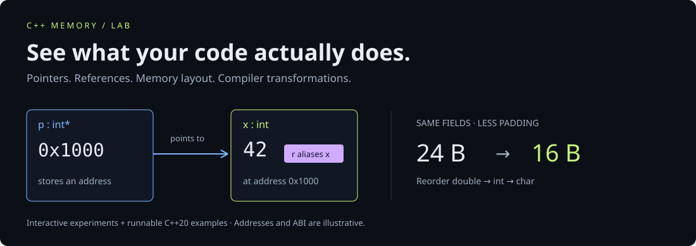

# C++ Memory Lab

The default experience is now **Little Memory Adventures**: four playful animated stories, with Play/Pause, stepping, and replay. Follow a friend, pack space, grab cookies in a batch, and skip busywork. Plain-language captions lead; C++ explanations are tucked into an expandable section. The original technical experiments remain available at [the detailed lab](https://MannM-glitch.github.io/cpp-memory-lab/advanced.html).

**See what your code actually does.** An interactive field guide to C++ pointers, references, data layout, cache locality, and compiler optimization.

[Open the lab](https://MannM-glitch.github.io/cpp-memory-lab/) · [Validation runs](https://github.com/MannM-glitch/cpp-memory-lab/actions/workflows/ci.yml) · [Runnable C++](examples/experiments.cpp)



Four experiments, a byte-level visual language, and runnable examples that connect the diagrams to real C++. Dark canvas, lime highlights, responsive layouts, native keyboard controls, reduced-motion support, and screen-reader descriptions of every diagram. No application runtime dependencies or server backend. A DOM library is used only for development tests. Fonts load from Google Fonts with local fallbacks; the lab remains functional without them.

| Experiment                     | Try this                                               | What to notice                                                                                     |
| ------------------------------ | ------------------------------------------------------ | -------------------------------------------------------------------------------------------------- |
| **01 · Pointers & references** | Step through `p = &y`, then `r = y`                    | Reseating a pointer changes its target; assigning through a reference changes its original object. |
| **02 · Memory layout**         | Pack fields by alignment and increase the object count | The illustrative struct drops from 24 to 16 bytes while keeping 13 bytes of payload.               |
| **03 · Cache locality**        | Run row-first and column-first traversals              | The explicit small-cache model produces 16 versus 64 misses.                                       |
| **04 · Compiler lens**         | Select a transformation, vary input, toggle aliasing   | Legal rewrites preserve results; aliasing can prevent a tempting simplification.                   |

## Run locally

Requires Node.js 22 or later. Serving the lab needs no package installation:

```sh
git clone https://github.com/MannM-glitch/cpp-memory-lab.git
cd cpp-memory-lab
npm start
```

Open `http://127.0.0.1:4173`. Use the HTTP server because browser ES modules are not reliably supported through `file://`. Deep links use `#pointers`, `#layout`, `#cache`, and `#compiler`, so static hosting needs no rewrite rules.

For development verification:

```sh
npm ci
npm run check
npm test
```

Tests cover layout alignment and padding, LRU trace totals, unsigned wraparound equivalence, aliasing behavior, and interaction flows through all four experiments in a DOM emulator. DOM tests do not substitute for visual browser or assistive-technology testing.

## Run the C++ and inspect real output

With GCC or Clang supporting C++20:

```sh
mkdir -p build
g++ -std=c++20 -Wall -Wextra -Wpedantic -O2 examples/experiments.cpp -o build/experiments
./build/experiments
```

On Windows PowerShell, create the directory with `New-Item -ItemType Directory build -Force`, use `build/experiments.exe` as the output path, and run `./build/experiments.exe`.

Generate assembly on an x86 target with GCC:

```sh
g++ -std=c++20 -O0 -S -masm=intel examples/experiments.cpp -o build/O0.s
g++ -std=c++20 -O2 -S -masm=intel examples/experiments.cpp -o build/O2.s
g++ -std=c++20 -O3 -S -masm=intel -fopt-info-vec-all=build/vectorization.txt examples/experiments.cpp -o build/O3.s
```

Inspect `constant_fold`, `dead_store`, `strength_reduce`, `update`, and `add_arrays`. The CI workflow runs semantic assertions at `-O0`, `-O2`, and `-O3`, then uploads assembly and GCC vectorization diagnostics for each build. These are real compiler artifacts, unlike the page's explicitly illustrative rewrites. Do not define `NDEBUG` when running the assertion examples.

Optimization levels enable groups of passes whose details vary by compiler version and target. `-O3` does not guarantee a faster program. Vectorization may require runtime overlap checks; the sample does not promise disjoint arrays. Compare actual workloads and emitted code. See the [GCC optimization options](https://gcc.gnu.org/onlinedocs/gcc/Optimize-Options.html).

## Accuracy and assumptions

- **Addresses and sizes:** the pointer explorer uses fictional addresses, a 4-byte `int`, and an 8-byte pointer. It is an object relationship diagram, not a debugger or a promise about stack placement. An optimizing compiler can keep values in registers or eliminate objects entirely.
- **References:** the lab teaches lvalue references. They alias an existing object; assignment does not reseat them. The implementation may or may not need storage for a reference. A reference is not automatic lifetime protection. See the [C++ working draft: references](https://eel.is/c++draft/dcl.ref) and [reference initialization](https://eel.is/c++draft/dcl.init.ref).
- **Pointers and lifetime:** a null pointer must not be dereferenced. A raw pointer can outlive its object and become dangling. The C++ example contrasts a `unique_ptr` owner with a non-owning observer. See [compound types](https://eel.is/c++draft/basic.compound) and [object lifetime](https://eel.is/c++draft/basic.life).
- **Structs:** the byte map assumes `char` size/alignment 1/1, `int` 4/4, and `double` 8/8. Padding and alignment are ABI-dependent; the compiled example prints actual values. Reordering can change an ABI or serialized layout. Savings describe array element storage, excluding allocator metadata and excess capacity.
- **Cache:** an 8×8 row-major matrix of 4-byte ints begins on a cache-line boundary. The simulated cache holds four 16-byte lines, is fully associative, uses LRU replacement, starts empty, and has no prefetching. It counts reads and misses, not CPU cycles. Real cache hierarchies are more complex; the ratios are not benchmark speedups.
- **Compiler lens:** the page calculates a deterministic source-level model, not assembly or live compilation. Arithmetic examples use 32-bit unsigned modular arithmetic. Signed overflow has different rules. The aliasing example uses two `int*` parameters that may point to one object; changing them to references does not establish non-aliasing.
- **Capacity:** `vector::reserve` changes capacity, not size. Reallocation invalidates existing element pointers and references. Reserving once for an expected workload can avoid repeated growth; reserving excessively wastes space. See [vector capacity](https://eel.is/c++draft/vector.capacity).

## Project structure

```text
dist/                  Authored static app, ready to host
  index.html           Semantic shell and chapter navigation
  style.css            Responsive visual system
  model.js             Pure deterministic models
  app.js               Rendering and interactions
examples/              C++20 semantic and optimization examples
test/                  Model and DOM interaction tests
scripts/serve.mjs       Local development server
.github/workflows/     JavaScript/C++ validation and GitHub Pages
.openai/hosting.json    Optional private Sites deployment configuration
```

## Hosting and contributions

GitHub Pages publishes `dist/` after JavaScript checks pass. Set **Settings → Pages → Source → GitHub Actions** when using a fork. Any static host can serve the same directory. The optional Sites configuration belongs to the original deployment; remove it or register your own Site before using Sites on a fork.

To add a lesson, keep its numerical model in `model.js`, make assumptions visible, add interaction and boundary-case tests, and add a runnable C++ counterpart when practical. Do not label illustrative output as measured assembly or infer speedups from operation counts.

MIT licensed. See [LICENSE](LICENSE).
